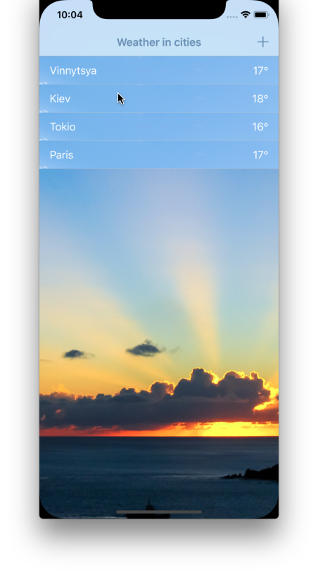
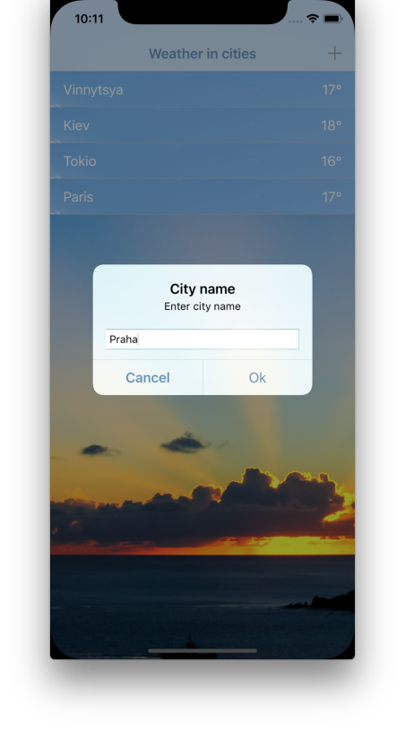
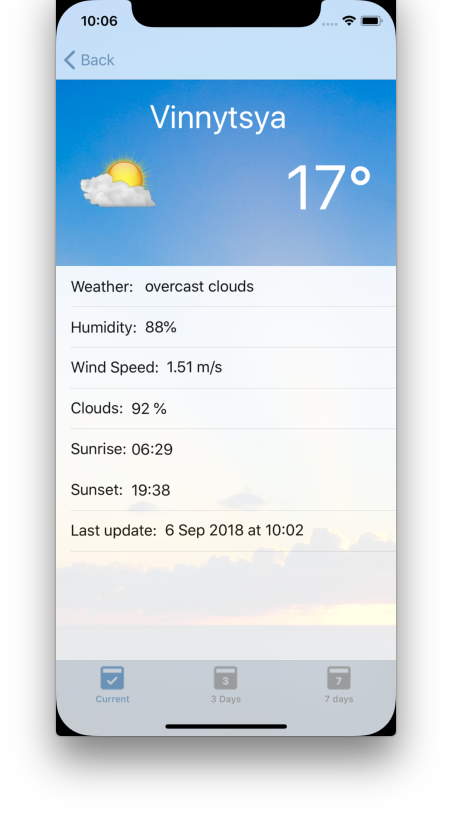
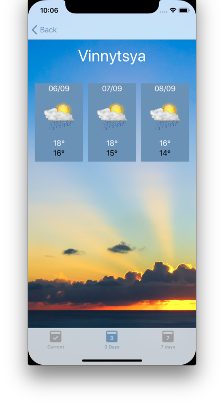
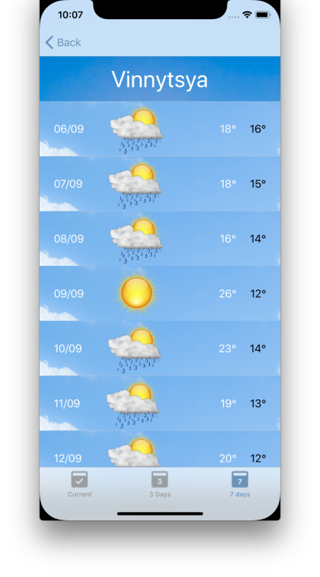

# Readme.md

# Weather app

This app shows current temperarure of list of cities. 
There is 2 default city Vinnytsya and Kiev. Also you can add your own city.
App shows detail data of selected city, and forecasts for 3 and 7 days. 
App using OpenWeatherMap API. [openweathermap.org](https://openweathermap.org "openweathermap.org")

###### List of cities 

Here you can add city and select one of it to check detail wether and forecasts. 

###### Detail weather data

###### 3 days forecast

###### 7 days forecast

